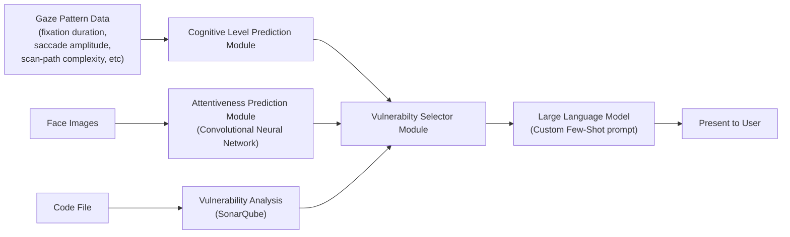

# Cognitive-Aware Plugin for Vulnerability Feedback
Andrew Sanders, Gursimran S. Walia, Ph.D., Lucas P. Cordova, Ph.D.

# TL;DR

## ***We propose a new tool and pedagogical approach to improve cybersecurity education.***

# Problem & Motivation

<!-- ## We Need to Improve Education in Developing Secure Code
&#10;- Software vulnerability exploitation remains a leading vector in breaches; secure coding must be integrated early [@verizonVerizon2023Data; @NISTSoftwareAssurance; @abetAccreditationChanges].  
- Existing static analyzers flag issues but rarely deliver **actionable, level-appropriate pedagogy** [@CWEFrequentlyAsked; @hazimhanifRiseSoftwareVulnerability2021].
&#10;## Prior Findings
&#10;- Vulnerabilities **increase and diversify** as students progress from CS1 → advanced courses [@sandersAnalysisSoftwareVulnerabilities2024].  
- Many CS programs lack sustained, program-wide security practice; students introduce vulnerabilities in routine coursework [@johnzorabedianVeracodeSurveyResearch; @sandersAnalysisSoftwareVulnerabilities2024; @sandersAssessingCommonSoftware2024].  
- Mismatch between vulnerabilities students actually produce and those emphasized in detection research [@sandersAssessingCommonSoftware2024; @yilmazUnderstandingSecurityVulnerabilities2022].  
- Time pressure & functionality-first norms drive insecure patterns; targeted feedback can help [@johnzorabedianVeracodeSurveyResearch; @yilmazUnderstandingSecurityVulnerabilities2022]. -->

## We Need to Improve Education in Developing Secure Code

> **Security failures start early.**  
> Students often learn to write code before they learn to write *secure*
> code.

- Software vulnerability exploitation remains a leading vector in
  breaches; secure coding must be integrated early \[1\], \[2\],
  \[3\].  
- Teaching students to use static analyzers early is important, but is
  very difficult due to the complexity of the output of these tools.
- Existing static analyzers flag issues but rarely deliver **actionable,
  level-appropriate pedagogy** \[4\], \[5\].

------------------------------------------------------------------------

## Prior Findings: What We Know So Far

> **Empirical evidence supports this gap.**

- Vulnerabilities **increase and diversify** as students progress from
  CS1 → advanced courses \[6\].  
- Many CS programs lack sustained, program-wide security practice;
  students introduce vulnerabilities in routine coursework \[6\], \[7\],
  \[8\].  
- Mismatch between vulnerabilities students actually produce and those
  emphasized in detection research \[8\], \[9\].  
- Time pressure & functionality-first norms drive insecure patterns;
  targeted feedback can help \[7\], \[9\].

## Research Gap

- Need an **evidence-based, scalable mechanism** that:
  - Grounds detection in a **truthful analyzer** \[4\]  
  - **Adapts feedback** to student level (beginner → advanced) \[10\]  
  - Supports **longitudinal study** across multiple
    courses/institutions  
  - Collects telemetry for **learning analytics**

# Proposed Approach

## Pedalogical

- **Pedalogical** = Static Analysis (truth base) **+** LLM (tailored
  feedback)

  - Analyzer: SonarQube CE (CWE mapping) → issues & hotspots \[4\]  
  - LLM: transforms findings into **scaffolded, actionable guidance**
    (tailored levels) \[10\]

## System Pipeline

<small>Grounded analyzer reduces hallucination risk; LLM provides
audience-appropriate feedback.</small>

## Pedagogical Learning Theories

- Integrates proven learning theories into the system design to enhance
  the learning experience:

  - **Cognitive Load Theory** \[10\]: convert verbose analyzer output →
    concise, relevant guidance (reduce extraneous load).
  - **Zone of Proximal Development** \[11\]: feedback level aligned to
    course maturity (scaffolding).

## Pedalogical Application

## Pedalogical Question Nodes

## Pedalogical LLM Question Generation

## Cybersecurity: Sample Student Feedback

## What Instructors Get

- Cohort dashboard: per-assignment vulnerability counts & trends.  
- Downloadable reports: analyzer findings, prompts/responses, submission
  diffs.  
- Configurable **feedback detail level** for scaffolding.

## Sample Instructor Report

# Proposed Study Context

## Research Questions

**RQ1:** Is AI-generated vulnerability feedback associated with
**reduced vulnerabilities** in revised submissions?    

**RQ2:** Does exposure to AI-generated vulnerability feedback **improve
secure coding practices** over time?

## Proposed Study Context

- Multi-course, multi-institutional.
- Undergraduate courses (intro → advanced; multiple sections; in-person
  & online).
- Incentivized via **bonus points** contingent on meeting minimum
  functionality and reducing vulnerabilities.

## Data & Measures

- **Static analysis artifacts:** CWE-tagged vulnerabilities, security
  hotspots, bugs, code smells.  
- **Engagement telemetry:** time on feedback, resubmission frequency,
  interaction with explanations.  
- **Learning signals:** pre/post patterns across assignments; regression
  models of engagement → reduction.  
- **Qualitative:** end-of-semester survey on usefulness & strategies.

## Analysis Plan

- Longitudinal within-course and cross-course comparisons.  
- Regression modeling: engagement metrics → vulnerability change.  
- Category-level success: which CWE types improve most?  
- Sensitivity to bonus-point variability across courses (limitations
  acknowledged).

## Expected Contributions

- A **replicable pipeline** for secure-coding feedback integrated into
  non-security courses.  
- Evidence that **grounded LLM feedback** can reduce vulnerabilities and
  shape habits .  
- A platform for **program-level learning analytics** on secure coding.

## Anticipated Threats & Limitations

- Bonus-point schemes differ across courses → potential confounds.  
- Structured prompts mitigate LLM variability, but do not eliminate it
  \[12\].

# Encouraging Early Analysis

## Pedalogical in a CS2 (Data Structures) Course

- Students designed and selected data structures for a medium-sized
  programming project.
- Experimental group used the Pedalogical chatbot for guided reasoning
  and scaffolding, while the control group used a generic ChatGPT-4.0
  wrapper, enabling comparison of design quality, reasoning depth, and
  tool engagement.
- Students in the experimental group performed significantly better on
  project outcomes, suggesting increased metacognitive awareness and
  problem-solving strategies based on rubric-based grading.

## Call to Action

- Adopt Pedalogical in non-security courses to **normalize secure
  coding**.  
- Collaborate on **cross-institutional studies** and shared analytics.  
- Extend to additional languages & rulesets; explore adaptive feedback
  policies.

# Thank You!

## Contact Information

   

<H2>

👨‍💻 ***Lucas Cordova***
</H2>

- 📬 <lpcordova@willamette.edu>
- 🌐 [lpcordova.com](https://lpcordova.com)

# References

## References

\[1\]
Verizon, “Verizon 2023 Data Breach
Investigations Report,” *Verizon Business*. Accessed: Oct. 30, 2024.
\[Online\]. Available:
<https://www.verizon.com/business/resources/reports/dbir/>

\[2\]
“NIST Software Assurance Reference
Dataset,” *NIST Software Assurance Reference Dataset*. Accessed: Feb.
22, 2023. \[Online\]. Available: <https://samate.nist.gov/SARD>

\[3\]
ABET, “Accreditation Changes.”
Accessed: Feb. 02, 2023. \[Online\]. Available:
<https://www.abet.org/accreditation/accreditation-criteria/accreditation-changes/>

\[4\]
“CWE - Frequently Asked Questions
(FAQ).” Accessed: Mar. 08, 2023. \[Online\]. Available:
<https://cwe.mitre.org/about/faq.html>

\[5\]
Hazim Hanif, Mohd Hairul Nizam Md
Nasir, Mohd Faizal Ab Razak, Ahmad Firdaus, and Nor Badrul Anuar, “The
rise of software vulnerability: Taxonomy of software vulnerabilities
detection and machine learning approaches,” *Journal of Network and
Computer Applications*, vol. 179, p. 103009, Apr. 2021, doi:
[10.1016/j.jnca.2021.103009](https://doi.org/10.1016/j.jnca.2021.103009).

\[6\]
A. Sanders, G. S. Walia, and A.
Allen, “Analysis of Software Vulnerabilities Introduced in Programming
Submissions Across Curriculum at Two Higher Education Institutions,” in
*2024 IEEE Frontiers in Education Conference (FIE)*, Oct. 2024.

\[7\]
John Zorabedian, “Veracode Survey
Research Identifies Cybersecurity Skills Gap Causes and Cures,”
*Veracode*. Accessed: Jul. 12, 2023. \[Online\]. Available:
<https://www.veracode.com/blog/security-news/veracode-survey-research-identifies-cybersecurity-skills-gap-causes-and-cures>

\[8\]
A. Sanders, G. S. Walia, and A.
Allen, “Assessing Common Software Vulnerabilities in Undergraduate
Computer Science Assignments,” *Journal of The Colloquium for
Information Systems Security Education*, vol. 11, no. 1, p. 8, Feb.
2024, doi:
[10.53735/cisse.v11i1.179](https://doi.org/10.53735/cisse.v11i1.179).

\[9\]
T. Yilmaz and Ö. Ulusoy,
“Understanding security vulnerabilities in student code: A case study in
a non-security course,” *Journal of Systems and Software*, vol. 185, p.
111150, Mar. 2022, doi:
[10.1016/j.jss.2021.111150](https://doi.org/10.1016/j.jss.2021.111150).

\[10\]
J. Sweller, J. J. van Merriënboer,
and F. Paas, “Cognitive architecture and instructional design: 20 years
later,” *Educational Psychology Review*, vol. 31, no. 2, pp. 261–292,
2019.

\[11\]
L. S. Vygotsky, *Mind in society:
The development of higher psychological processes*. Cambridge, MA:
Harvard University Press, 1978.

\[12\]
Y. Shen *et al.*, “ChatGPT and
other large language models are double-edged swords,” *Radiology*, vol.
307, no. 2, p. e230163, 2023, doi:
[10.1148/radiol.230163](https://doi.org/10.1148/radiol.230163).

